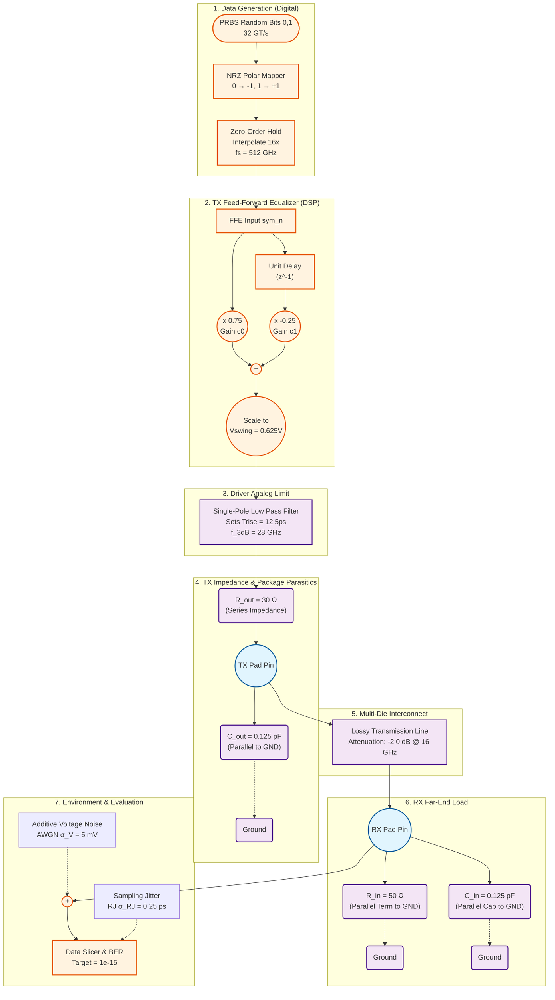
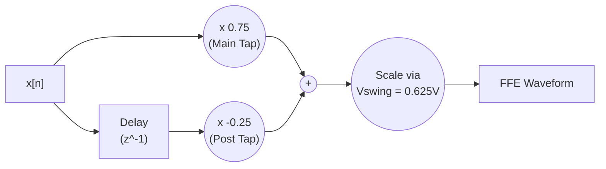
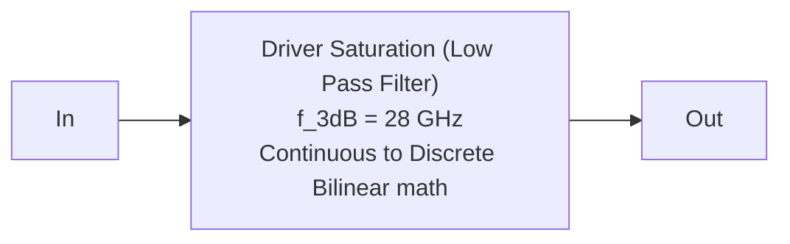
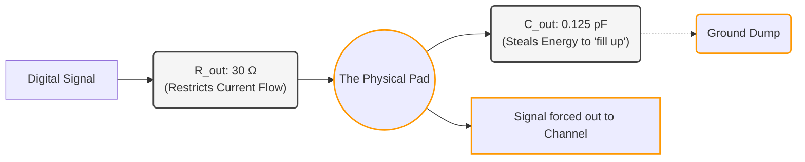
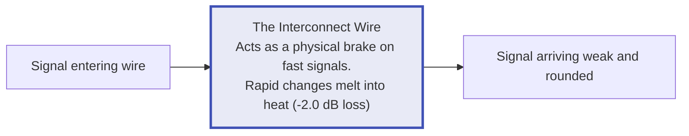
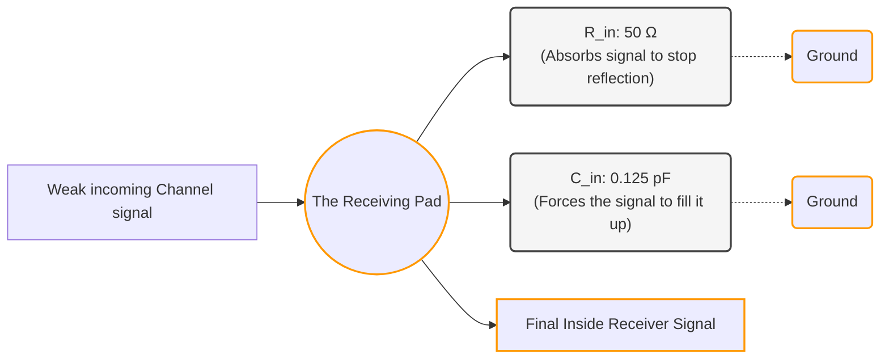
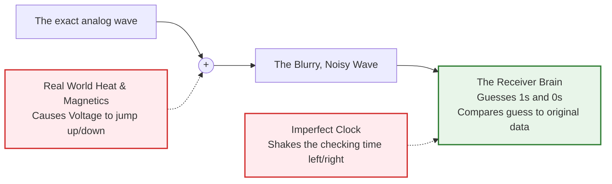
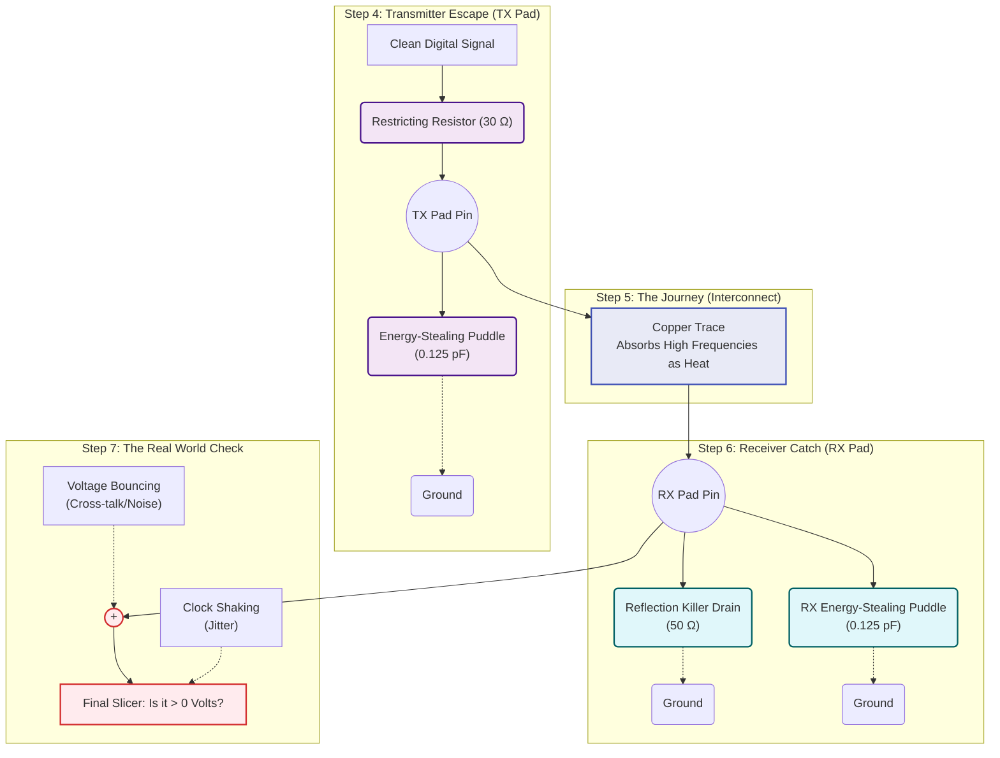

# UCIe TX 2.0: Full Architecture Block & Circuit Diagrams

This document outlines the entire UCIe 2.0 Transmitter (TX) behavioral model. It maps the software/MATLAB algorithms directly into architectural and electrical circuit equivalents, featuring series/parallel layouts and standard values explicitly drawn from the UCIe 32 GT/s System-Level specification (MathWorks reference).

---

## 🌟 The Unified System Overview (Grand Block Diagram)

Below is the complete path of a bit traversing from the internal silicon logic of the transmitter chip, out through its package physical pads, across the channel trace, and finally terminating inside the receiver pad.

---

## Detailed Block Diagrams (Step-by-Step Breakdown)

Here is how each sub-system is isolated and mathematically implemented based on specific operational values.

### 1. PRBS & NRZ Stimulus Generator
**What it does:** Simulates generating target silicon data at high speeds (32 Trillion logic operations per second).
- **Values:** Data Rate = 32 GT/s. Symbol Time (UI) = 31.25 ps. Sample Rate (fs) = 512 GHz.
- **Operations:** Converts binary to signed analog logic variables (+1, -1), then clocks them into continuous arrays multiplying it out by 16 times per interval.

### 2. TX Feed-Forward Equalizer (FFE)
**What it does:** Corrects for line losses by shaping current before it leaves the chip.
- **Values:** Total target Swing (`Vswing`) = 0.625 V. Taps vary (e.g., Preset 3: Main Tap `c0` = 0.75, Post Tap `c1` = -0.25).
- **Circuit/Logic:** Parallel signal paths. The original signal path multiplies by `c0` directly. A secondary path places the signal in a memory delay buffer (Delay $Z^{-1}$), multiplies it by `c1`, and **Adds** both into the outgoing voltage pipeline.

### 3. TX Edge Shaping (Rise Time Filter)
**What it does:** Drivers cannot instantaneously swap from -0.312V to +0.312V. They stretch over time.
- **Values:** Target Rise time ($t_{rise}$) = 12.5 ps. Using formula $f_{3dB} \approx 0.35 / t_{rise}$, Bandwidth cut is isolated to 28 GHz.
- **Circuit/Logic:** Models the transistor's raw analog saturation capabilities as a digital Single-Pole mathematically cascaded Low-Pass Filter.

### 4. TX Impedance & Package Parasitics (Leaving the Chip)
**What is happening?** The signal is trying to physically leave the transmitter silicon die through a microscopic metal pad.
* **The Resistor ($R_{out}$ Series):** In plumbing, if you have infinite pressure, you burst the pipes. To prevent the chip from destroying itself by driving infinite current, an intentional 30 $\Omega$ resistor is placed in the way to choke the current.
* **The Capacitor ($C_{out}$ Parallel):** The metal pad on the chip physically acts like a tiny puddle/reservoir (parasitic capacitance). Before the voltage can push down the wire, it has to "fill up" this puddle. This steals the initial burst of energy and causes your sharp, fast digital signal edges to slow down and slump.

### 5. Multi-Die Interconnect (The Channel)
**What is happening?** The signal is now traveling across the physical microscopic wires (traces) connecting Chip A to Chip B.
* At 32 GT/s, electricity is switching directions 32 billion times a second. At these extreme speeds, the wire stops acting like a perfect pipe.
* **Skin Effect & Dielectric Loss:** The electrons start riding violently on the outside skin of the copper, turning into heat. Furthermore, the insulation (plastic) around the wire absorbs the ultra-fast AC transitions.
* **The Result:** Sharp, rapid transitions get heavily erased and swallowed, while long, held signals survive. We measure this "swallowing" as a -2.0 dB loss (getting weaker) at high frequencies (16.0 GHz).

### 6. RX Far-End Load (Arriving at the Receiver)
**What is happening?** The signal has arrived at the destination chip (the receiver) and must enter it.
* **The Resistor ($R_{in}$ Parallel):** If you shoot high-pressure water down a pipe and it hits a solid wall at the end, it will violently splash backwards. In electrical traces, this is called **Signal Reflection**. The returning "ghost signal" crashes into incoming signals and destroys them. To stop this, we open a 50 $\Omega$ drain at the end (Parallel to Ground). It perfectly, safely absorbs the incoming signal pressure like an infinity pool, killing reflections.
* **The Capacitor ($C_{in}$ Parallel):** Just like the transmitter, the receiver has a metal pad that acts like a puddle (0.125 pF). The incoming signal must "fill up" this puddle before the receiver can read it, rounding off the signal's edges one final time.

### 7. Environment & Evaluation (Factoring the Real World)
**What is happening?** Everything previous assumes a perfect universe. But the inside of a computer is chaotic.
* **Additive Voltage Noise (AWGN):** Other wires are buzzing right next to ours (Cross-talk). The Power Supply is rippling. Millions of other transistors are switching. This causes our signal's height/voltage to bounce up and down randomly by roughly 5 mV.
* **Sampling Jitter:** The computer's internal clock heartbeat ticks to say *"Read the value NOW"*. But that heartbeat isn't perfect; occasionally it ticks 0.25 ps too early or too late.
* **The Slicer (BER):** You now have a short, rounded, blurry, shaky signal. The receiver looks directly at the center of the time window. If the voltage is above 0, it guesses the bit is a `1`. If below 0, it guesses `0`. We compare that against what we actually sent in Step 1 to calculate our **Bit Error Rate (BER)**.

---

### The Big Picture (All Analog Steps Combined)

When you stitch the physical sequence together, the entire second half of your code is essentially doing this:

1. **Step 4:** Shoving the mathematical signal out of the chip, losing speed to the pad's impedance.
2. **Step 5:** Pushing it through a tiny wire where speed creates heat, weakening the signal.
3. **Step 6:** Catching it at the far end, using a terminator to stop the signal from bouncing backward, while losing speed to the final pad.
4. **Step 7:** Imposing random real-world shaking/noise to it, and making a blind guess if it's still recognizable as a `1` or `0`.

